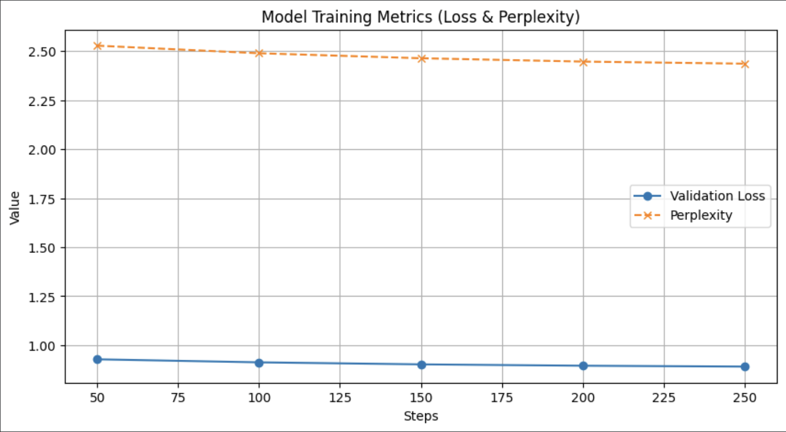
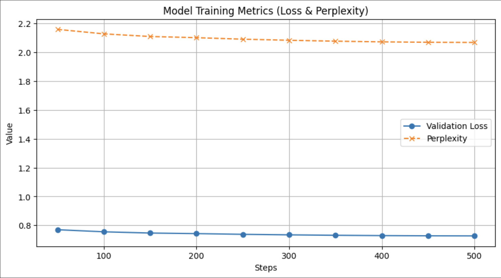
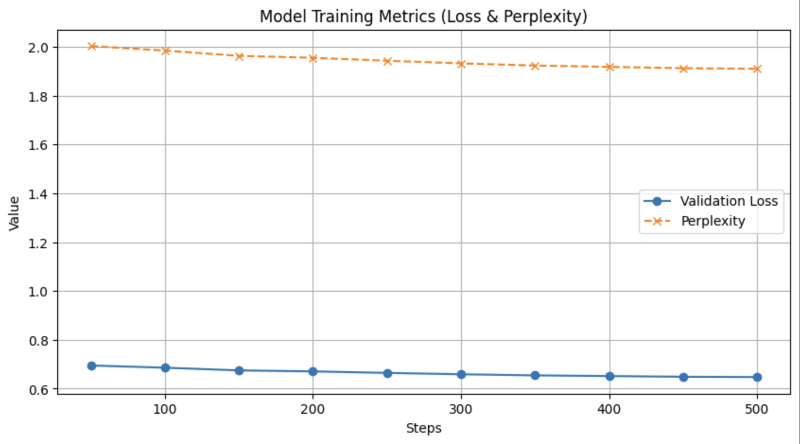

# VetAI — Fine-Tuning Llama 3 into a Veterinary Assistant

Fine-tunes a quantized **Llama 3.1 8B** into a pet-care assistant that answers
owners' questions in a supportive, non-diagnostic tone — and runs on CPU-only
hardware.

General-purpose chat models are helpful but generic: they either refuse
pet-health questions or answer with clinical detail an owner cannot act on. This
project shows the full path from a base checkpoint to a deployed domain
assistant — instruction tuning, domain adaptation, evaluation, quantization and
deployment — on a **single free Google Colab T4**, with no GPU at serving time.

Built as Lab 2 of KTH's *ID2223 Scalable Machine Learning and Deep Learning*.

👉 **Live demo:** https://huggingface.co/spaces/stromano02/Iris
(Hugging Face Space; it sleeps when idle and takes a few seconds to wake up.)

📦 **Model weights:** https://huggingface.co/stromano02/model
(merged 16-bit safetensors + `q8_0` GGUF.)

---

## Features

- **Two-stage fine-tuning.** Instruction tuning on FineTome-100k, then a short
  low-learning-rate pass on ~100 curated veterinary dialogues to shift tone and
  domain vocabulary without catastrophic forgetting.
- **Fits on free-tier hardware.** 4-bit NF4 quantization plus LoRA adapters
  (`r=32`) make an 8B model trainable in the 16 GB of a Colab T4: ~84M trainable
  parameters, about 1% of the model.
- **Measured, not assumed.** A held-out split gives validation loss and
  perplexity every 50 steps, so model selection is a number rather than a
  vibe — three model sizes were trained and compared.
- **Loss on completions only.** User turns are masked so the model learns to
  answer, not to imitate prompts.
- **Resumable training.** Checkpoints land on Google Drive every 50 steps, which
  survives Colab recycling a session mid-run.
- **CPU deployment path.** The best adapters are merged back into the base
  weights and exported to 8-bit GGUF for `llama.cpp`, served from a Hugging Face
  Space with no GPU.

## Results

| Base model | LoRA rank / alpha | Lowest val loss | Best perplexity |
|---|:---:|:---:|:---:|
| Llama-3.2-1B-Instruct | 16 / 16 | 0.8906 | 2.4366 |
| Llama-3.2-3B-Instruct | 16 / 16 | 0.7266 | 2.0680 |
| **Meta-Llama-3.1-8B-Instruct** | 32 / 32 | **0.6474** | **1.9106** |

Perplexity improves 15.1% from 1B to 3B and a further 7.6% from 3B to 8B, so the
8B configuration was the one carried through domain adaptation and deployment.

| Llama-3.2-1B | Llama-3.2-3B | Meta-Llama-3.1-8B |
|:---:|:---:|:---:|
|  |  |  |

A manual benchmark on five fixed prompts (conceptual clarity, transitive
reasoning, concision, empathy, arithmetic), the scores, the full model
transcripts and an honest account of what that benchmark does **not** prove are
in **[docs/evaluation.md](docs/evaluation.md)**.

## Tech stack

| Layer | Choice |
|---|---|
| Base models | Meta-Llama-3.1-8B-Instruct, Llama-3.2-3B/1B-Instruct (4-bit NF4) |
| Training | [Unsloth](https://github.com/unslothai/unsloth) 2025.11.6, TRL `SFTTrainer`, PEFT LoRA (rsLoRA) |
| Framework | PyTorch 2.9.1 + CUDA 12.8, Transformers 4.57.3, Datasets |
| Optimizer | `adamw_8bit` (bitsandbytes), linear schedule, gradient checkpointing |
| Data | [FineTome-100k](https://huggingface.co/datasets/mlabonne/FineTome-100k) (10k slice) + a custom veterinary JSONL set |
| Metrics | pandas / NumPy / Matplotlib |
| Serving | GGUF `q8_0` via `llama.cpp`, Hugging Face Spaces (CPU) |
| Hardware | 1× NVIDIA T4, 16 GB (Google Colab free tier) |

## Getting started

The notebook is written for Google Colab, which is where the reported runs were
executed.

### Run it on Colab (recommended)

1. Open `notebooks/01_llama3_finetuning_vetai.ipynb` in Colab and select a
   **T4 GPU** runtime (*Runtime → Change runtime type → T4*).
2. Edit the configuration cell at the top:
   ```python
   OUTPUT_DIR = "/content/drive/MyDrive/llama3-8b-vetai"
   VETAI_DATASET_PATH = f"{OUTPUT_DIR}/vetai_dataset_100.jsonl"
   HF_REPO = "your-username/your-model"
   RESUME_FROM_CHECKPOINT = False
   ```
3. Put your veterinary dataset at `VETAI_DATASET_PATH`. The schema and a
   three-line sample are in [`data/`](data/README.md).
4. Authenticate with the Hub *before* the export cells, so no token ever lives
   in the notebook:
   ```python
   from huggingface_hub import login
   login()  # or set the HF_TOKEN environment variable
   ```
5. Run all cells. Full run time is roughly 4–5 hours on a T4: ~2 h of training,
   the rest merging and converting the 8.5 GB GGUF.

### Run it locally

Needs a CUDA GPU with ≥16 GB of VRAM.

```bash
git clone https://github.com/emanueleminotti/llm-finetuning-vet-assistant.git
cd llm-finetuning-vet-assistant

python -m venv .venv && source .venv/bin/activate
pip install torch==2.9.1 --index-url https://download.pytorch.org/whl/cu128
pip install -r requirements.txt

jupyter lab notebooks/01_llama3_finetuning_vetai.ipynb
```

Remove the first cell (`drive.mount`) and point `OUTPUT_DIR` at a local
directory.

## Usage example

Inference against the fine-tuned adapters. `generate()` is the helper defined in
the notebook (section 7):

```python
from unsloth import FastLanguageModel

model, tokenizer = FastLanguageModel.from_pretrained(
    model_name=OUTPUT_DIR,  # base model + trained LoRA adapters
    max_seq_length=2048,
    load_in_4bit=True,
)
FastLanguageModel.for_inference(model)

print(generate("I'm worried because my dog has been acting differently lately."))
```

Actual output from the benchmark run (full transcripts in
[docs/evaluation.md](docs/evaluation.md)):

```text
It's completely understandable to feel worried when your dog acts differently.
Behavior changes can feel unsettling. Try offering a calm environment and observe
things gently over time. If the change continues, a veterinarian can help you
understand what might be going on.
```

Note the two behaviours the domain pass was meant to produce: an empathetic
opening, and a referral to a vet instead of a guess at a diagnosis.

Serving the GGUF export on CPU instead:

```bash
./llama-cli -m llama-3.1-8b-vetai-q8_0.gguf \
  -p "How often should I brush my cat?" -n 128
```

## How it works

```
Meta-Llama-3.1-8B-Instruct (4-bit NF4)
        │
        ├─ + LoRA adapters (r=32, α=32, rsLoRA) ── ~84M trainable params (1%)
        │
        ▼
Stage 1 — instruction tuning
   FineTome-100k, 10k conversations (9k train / 1k val)
   500 steps · lr 1e-4 · effective batch 8 · loss on completions only
   eval + checkpoint every 50 steps → best val loss 0.6474
        │
        ▼
Stage 2 — domain adaptation (VetAI)
   ~100 veterinary dialogues (88 train / 10 val)
   1 epoch · 44 steps · lr 5e-5
        │
        ▼
Export
   merge adapters → 16-bit → GGUF q8_0 (8.5 GB, 292 tensors)
        │
        ▼
Hugging Face Space (llama.cpp, CPU-only)
```

### Design decisions

- **LoRA over full fine-tuning.** Full fine-tuning of an 8B model needs an order
  of magnitude more VRAM than a T4 has. LoRA on the attention and MLP
  projections keeps the trainable set at ~1% of the weights; rank-stabilized
  LoRA keeps the update scale sane at `r=32`.
- **500 steps, deliberately.** Colab's free tier reclaims runtimes after a few
  hours, so the step budget was set to finish inside that window. The validation
  curves flatten well before the end, so more steps would have bought little.
- **Higher rank for the larger model only.** The 8B run used `r=32` and a lower
  learning rate (1e-4 vs 2e-4) — more adapter capacity, smaller steps. This
  means the 1B/3B/8B comparison varies two things at once and measures whole
  configurations rather than isolating scale.
- **A second, tiny training pass instead of one mixed dataset.** Sequential
  tuning keeps the two stages independently reproducible and lets the domain pass
  use its own learning rate. The cost is a risk of drift on general ability,
  mitigated by 5e-5 and a single epoch.
- **Best checkpoint, not last.** `load_best_model_at_end=True` means the exported
  weights are the ones that scored best on the held-out split.
- **GGUF q8_0 for serving.** The target Space has no GPU. 8-bit keeps quality
  close to the merged 16-bit weights while halving the file size, and
  `llama.cpp` runs it on CPU.

### Known limitations

- The veterinary dataset is ~100 examples: enough to shape tone, not enough to
  add clinical knowledge. The assistant is a communication layer, not a
  diagnostic tool.
- The manual benchmark is a five-prompt, single-run, author-scored sanity check.
  See [docs/evaluation.md](docs/evaluation.md) for what it does and does not
  support.
- The veterinary dataset itself is not redistributed; only its schema and a
  sample are in `data/`.

## Repository layout

```
notebooks/01_llama3_finetuning_vetai.ipynb   end-to-end pipeline
data/README.md                               dataset schema + sample
docs/evaluation.md                           metrics, benchmark, transcripts
docs/results/                                validation curves (1B / 3B / 8B)
requirements.txt                             pinned environment
```

## Authors

Emanuele Minotti · Stefano Romano

Licensed under the [MIT License](LICENSE).
